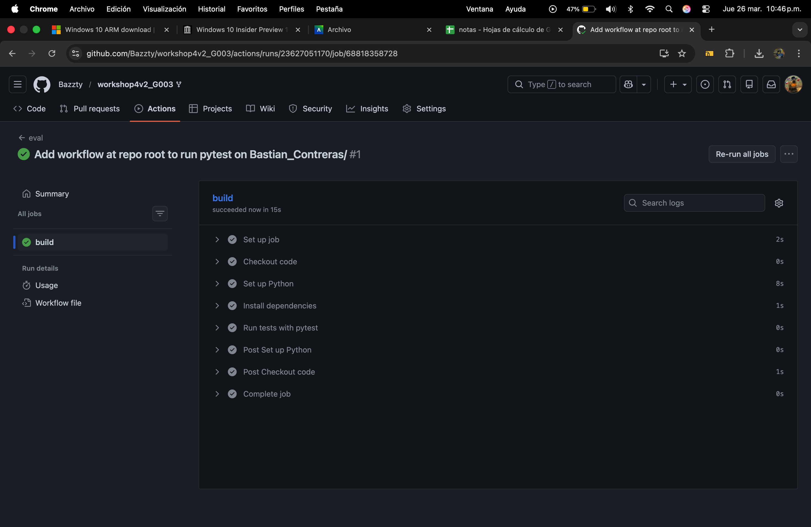

# Taller 04 - Bastian Contreras

## Archivos entregados

- `functions.py` — funciones corregidas
- `test_functions.py` — tests corregidos
- `.github/workflows/workflow.yml` — pipeline de CI corregido

## GitHub Action ejecutado exitosamente

